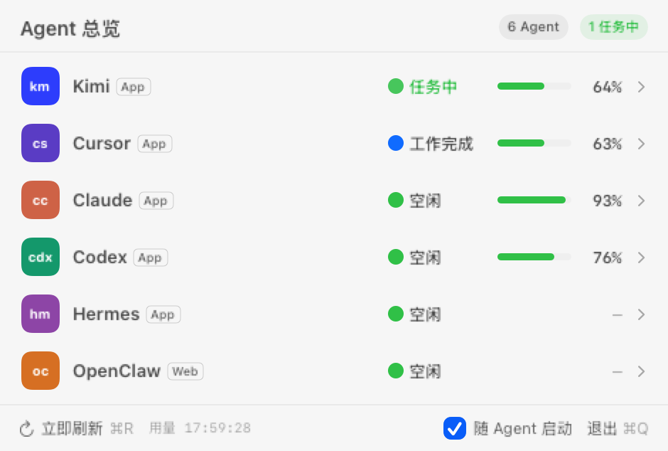

# Agent Overview for macOS

A native macOS menu-bar utility for monitoring local AI coding agents.

[](https://github.com/scorpionsguo1989-hash/agent-overview-macos/actions/workflows/ci.yml)
[](https://github.com/scorpionsguo1989-hash/agent-overview-macos/releases/latest)
[](LICENSE)



> This image is generated by the deterministic UI test fixture. Every status,
> percentage, reset time, and source label is synthetic; it is not a screenshot
> of a real account or task.

Agent Overview displays coarse task state for Claude, Codex, Kimi, Cursor, Hermes,
and OpenClaw. The public build also shows Codex quota windows through the locally
installed Codex `app-server` interface.

## Why this project exists

When several coding agents are running, it is hard to see which one is working,
waiting for input, finished, or offline. Agent Overview keeps those signals in one
small menu-bar panel without copying task content to a server.

## Features

- Native AppKit and SwiftUI menu-bar interface.
- Six stable agent identity badges.
- Offline, idle, working, awaiting-input, completed, and error states.
- Codex 5-hour and weekly quota windows and reset times.
- Low-quota notifications with deduplication.
- Optional launch watcher that reopens the panel with supported agent apps.
- No telemetry, analytics SDK, API key, or cloud backend.

## Privacy and security

The open-source build intentionally excludes credential-based quota adapters. It
does not read Claude cookies or Cursor/Kimi access tokens. Claude, Kimi, Cursor,
Hermes, and OpenClaw are status-only.

Codex usage is read by starting the locally installed Codex executable in
`app-server` mode and calling `account/rateLimits/read`. Derived quota data is
cached locally with file mode `0600`. See [PRIVACY.md](PRIVACY.md) and
[SECURITY.md](SECURITY.md).

## Requirements

- Apple Silicon Mac
- macOS 13 or later
- Xcode Command Line Tools
- ChatGPT or Codex installed for Codex quota display

## Build

```bash
./scripts/privacy-check.sh
./scripts/test.sh
./scripts/build.sh
```

The ad-hoc signed app is written to:

```text
$TMPDIR/AgentOverviewBuild/Agent Overview.app
```

To install the local build:

```bash
ditto "$TMPDIR/AgentOverviewBuild/Agent Overview.app" "/Applications/Agent Overview.app"
open "/Applications/Agent Overview.app"
```

The source build is ad-hoc signed and is not notarized. macOS may require explicit
approval before first launch.

## Contributing

Community contributions are welcome. Start with the
[v0.2.0 milestone](https://github.com/scorpionsguo1989-hash/agent-overview-macos/milestone/1)
or open a privacy-preserving feature request. Please read
[CONTRIBUTING.md](CONTRIBUTING.md) before submitting a pull request.

## Status sources

The app reads local process lists and limited state signals from each installed
agent. It reduces those signals to a status value; task text is not written to the
usage cache. Exact adapters may change when vendors update local formats.

## Scope

This project is an independent community utility and is not affiliated with or
endorsed by OpenAI, Anthropic, Moonshot AI, Cursor, Hermes, or OpenClaw. Product
names are used only to identify compatible local software.

## License

MIT

---

## 中文简介

Agent Overview 是一款原生 macOS 菜单栏工具，用于查看多个本地 AI Agent 的
离线、空闲、工作中、等待人工、完成和异常状态。公开版只通过本地 Codex
`app-server` 读取 Codex 额度，不读取任何平台的 Cookie、Token、密码或 API Key。
